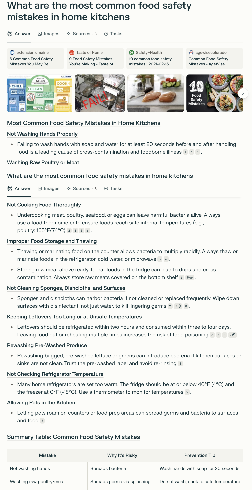
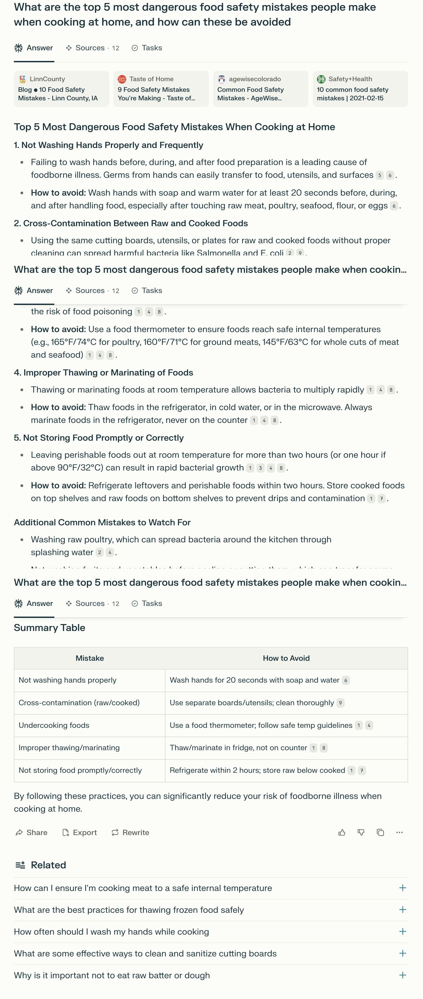
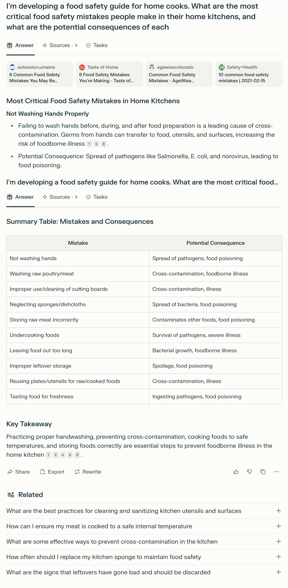
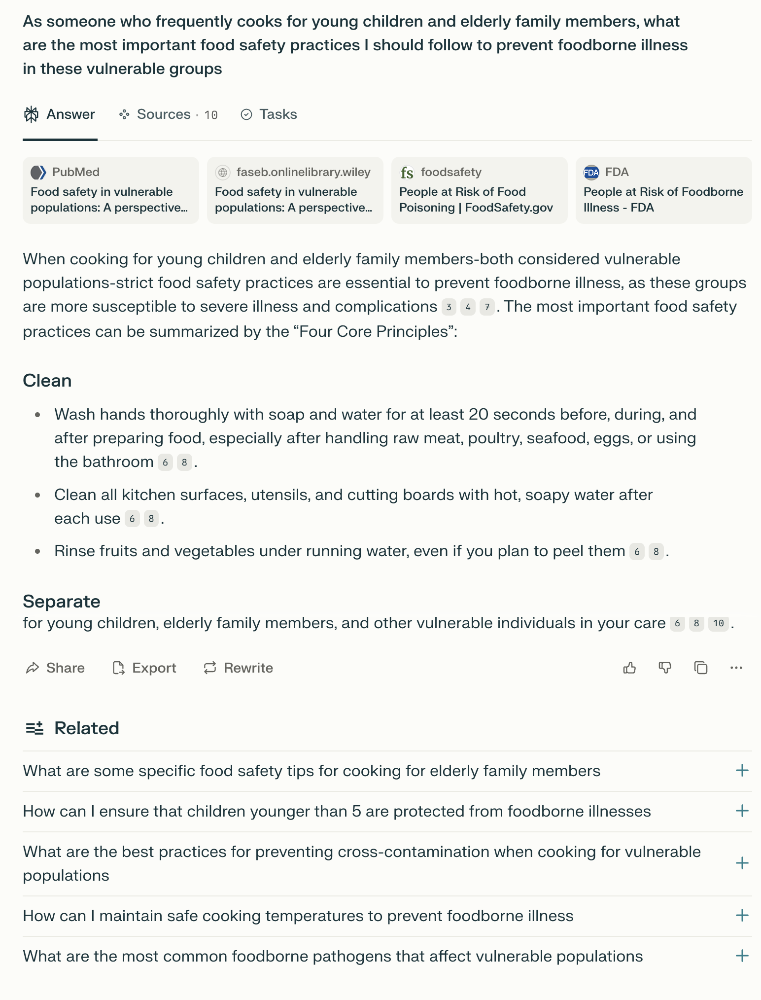
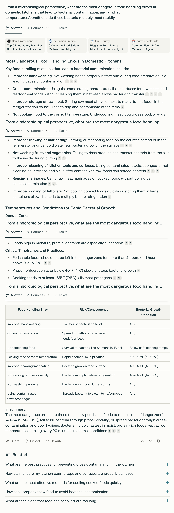
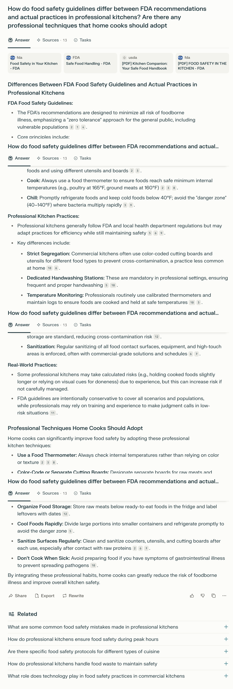
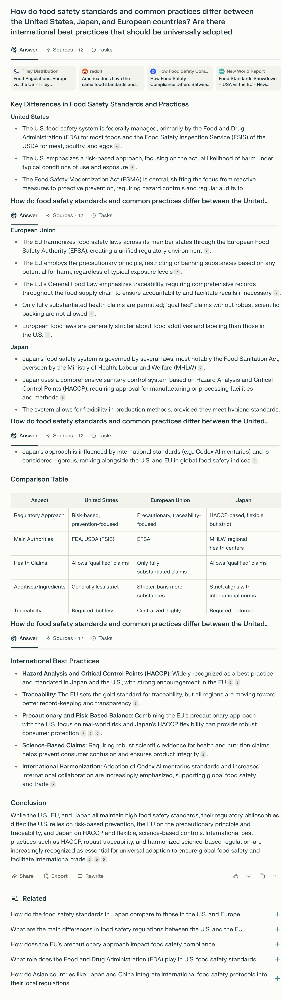

# Basic Prompts

## Prompt 1: Basic – Simple Question

### Prompt:
What are the most common food safety mistakes in home kitchens?

### Answer Link:
[answer link](https://www.perplexity.ai/search/what-are-the-most-common-food-y1mt2bL6Q1K_pnh1jkvq.Q)

### Screenshot:

### Retrieved Sources:
- [umaine - Food safety mistakes](https://extension.umaine.edu/food-health/2024/06/20/food-saftey-mistakes/) (.edu)
- [Taste of home - Food safety mistakes](https://www.tasteofhome.com/collection/food-safety-mistakes/) (blog)
- [Safety+Health – 10 Common Food Safety Mistakes](https://www.safetyandhealthmagazine.com/articles/20823-common-food-safety-mistakes) (news)
- [AgeWise Colorado – Food Safety](https://agewisecolorado.org/blog/common-food-safety-mistakes/) (organization)

### Source Diversity:
- diverse mix
- no .gov or peer-reviewed

### Source Recency:
Most links appear recent (2021–2024), but not all show clear publication dates in preview

### Answer Completeness: 4/5
- Covers a wide range of common mistakes (e.g., handwashing, raw meat, sponges, temperature control)
- Includes a useful summary table with cause + prevention

### Answer Relevance: 5/5
- Directly answers the prompt with clearly structured content
- Matches home kitchen context well

### Key Insights Provided:
- Specific prevention tips (e.g., “wash hands 20 seconds”)
- Importance of thermometer use, fridge temp standards
- Risk of re-washing pre-washed produce
- Clear connection between mistake → risk → prevention

### Missing Information:
- No reference to at-risk populations (elderly, immunocompromised)
- No mention of food labeling or expiration date handling
- Lacks citation from government (.gov) or academic research

## Prompt 2: Basic – More Specific

### Prompt:
What are the top 5 most dangerous food safety mistakes people make when cooking at home, and how can these be avoided?

### Answer Link:
[answer link](https://www.perplexity.ai/search/what-are-the-top-5-most-danger-OGuCtSAfRBaBcNT7_CPkEA)

### Screenshot:

### Retrieved Sources:
- [Linn County - Food safety mistakes](https://www.linncountyiowa.gov/Blog.aspx?IID=78) (.gov)
- [Taste of home - Food safety mistakes](https://www.tasteofhome.com/collection/food-safety-mistakes/) (blog)
- [AgeWise Colorado – Food Safety](https://agewisecolorado.org/blog/common-food-safety-mistakes/) (organization)
- [Safety+Health – 10 Common Food Safety Mistakes](https://www.safetyandhealthmagazine.com/articles/20823-common-food-safety-mistakes) (news)

### Source Diversity:
- Blog, nonprofit org, regional health department, magazine-style news
- No .edu or peer-reviewed sources

### Source Recency:
- Most sources appear from 2021–2024, generally recent  
- Some sources lack visible publication dates

### Answer Completeness: 5/5
- Clearly identifies 5 major mistakes with explanations and how-to-avoid tips
- Includes additional common mistakes and a summary table

### Answer Relevance: 5/5
- Fully answers both parts of the prompt: "most dangerous mistakes" and "how to avoid"
- Highly structured and focused on home kitchen context

### Key Insights Provided:
- Specific prevention methods for each mistake (e.g., thermometer, handwashing)
- Reinforcement of cold food storage rules (2-hour rule, fridge temp)
- Additional tips beyond top 5 (like not re-washing produce)
- Well-formatted summary table enhances clarity

### Missing Information:
- No prioritization of risks by severity or frequency
- Does not mention vulnerable populations (children, elderly, pregnant people)
- No visuals, downloads, or citations to scientific studies

## Prompt 3: Basic – with background

### Prompt:
What are the top 5 most dangerous food safety mistakes people make when cooking at home, and how can these be avoided?

### Answer Link:
[answer link](https://www.perplexity.ai/search/i-m-developing-a-food-safety-g-iUVtk9h_RqKKyOlm.0biSg?0=d)

### Screenshot:

### Retrieved Sources:
- [umaine - Food safety mistakes](https://extension.umaine.edu/food-health/2024/06/20/food-saftey-mistakes/) (.edu)
- [Taste of home - Food safety mistakes](https://www.tasteofhome.com/collection/food-safety-mistakes/) (blog)
- [AgeWise Colorado – Food Safety](https://agewisecolorado.org/blog/common-food-safety-mistakes/) (organization)
- [Safety+Health – 10 Common Food Safety Mistakes](https://www.safetyandhealthmagazine.com/articles/20823-common-food-safety-mistakes) (news)

### Source Diversity:
- Educational, blog, nonprofit, and news outlets
- No peer-reviewed journals or .gov sources

### Source Recency:
- Articles appear current (most between 2021–2024)
- Some sources lack visible publication/update dates

### Answer Completeness: 5/5
- Provides a list of mistakes with clearly stated consequences
- Includes a summary table mapping “mistake → consequence”
- Ends with a takeaway paragraph summarizing key actions

### Answer Relevance: 5/5
- Directly addresses both parts of the prompt: mistake identification and potential harm
- Focused entirely on home kitchen context

### Key Insights Provided:
- Common mistakes include: not washing hands, reusing utensils, improper storage, undercooking, etc.
- Explains consequences like bacterial growth, cross-contamination, foodborne illness
- Summary table makes information easy to scan and apply
- Emphasizes behavioral prevention (e.g., timing, temperatures, hygiene)

### Missing Information:
- Lacks scientific data or studies supporting danger level
- Does not cite high-risk groups (e.g., elderly, pregnant people)
- All sources are secondary summaries—no government (.gov) or academic primary data

# Prompts with Context
## Prompt 4: Personal Context

### Prompt:
As someone who frequently cooks for young children and elderly family members, what are the most important food safety practices I should follow to prevent foodborne illness in these vulnerable groups?

### Answer Link:
[answer link](https://www.perplexity.ai/search/as-someone-who-frequently-cook-pGf0fZ14QvG4rwT4jk2asA)

### Screenshot:

### Retrieved Sources:
- [Pubmed – Food Safety in Vulnerable Populations](https://pubmed.ncbi.nlm.nih.gov/37186117/) (academic)
- [FASEB Journal – Food Safety in Vulnerable Populations](https://faseb.onlinelibrary.wiley.com/doi/10.1096/fj.202201713R) (academic)
- [FoodSafety – People at Risk of Food Poisoning](https://www.foodsafety.gov/people-at-risk) (.gov)
- [FDA – People at Risk of Foodborne Illness](https://www.foodsafety.gov/people-at-risk) (.gov)

### Source Diversity:
- Strong mix of academic (.edu/.org), peer-reviewed, and official government (.gov) sources
- No blogs or lifestyle media—highly authoritative sources

### Source Recency:
- Sources are credible and relatively recent; government pages and journal articles are current as of 2020s

### Answer Completeness: 4.5/5
- Covers the Four Core Principles (Clean, Separate, Cook, Chill)
- Provides specific examples under each principle
- Some principles not fully elaborated (e.g., “Separate” lacks full explanation)

### Answer Relevance: 5/5
- Directly targets the prompt’s personal context (cooking for vulnerable individuals)
- Focuses on high-risk practices and prevention for children and elderly

### Key Insights Provided:
- Highlights that young children and older adults are at increased risk of severe illness
- Recommends washing hands thoroughly and cleaning surfaces after each use
- Emphasizes rinsing produce even if peeling, and avoiding cross-contamination
- Core structure framed around USDA’s Four Core Principles of food safety

### Missing Information:
- Does not explain how specific risks differ between children vs. elderly
- Only partially explains "Separate", "Cook", and "Chill" principles
- Lacks visual guides or downloadable checklist for caregivers

## Prompt 5: Technical Context

### Prompt:
From a microbiological perspective, what are the most dangerous food handling errors in domestic kitchens that lead to bacterial contamination, and at what temperatures/conditions do these bacteria multiply most rapidly?

### Answer Link:
[answer link](https://www.perplexity.ai/search/from-a-microbiological-perspec-epbk3723QJaUY2nCIiG4Xw)

### Screenshot:

### Retrieved Sources:
- [Sani Professional – 5 Food Safety Mistakes](https://saniprofessional.com/food-safety-mistakes-rules/) (commercial/industry)
- [umaine – 6 Common Mistakes](https://extension.umaine.edu/food-health/2024/06/20/food-saftey-mistakes/) (.edu)
- [LinnCounty – Blog on Safety](https://www.linncountyiowa.gov/Blog.aspx?IID=78) (blog)
- [AgeWise Colorado – Food Safety](https://agewisecolorado.org/blog/common-food-safety-mistakes/) (organization)

### Source Diversity:
- Mixed sources: university extension (.edu), local government/public health, industry commercial, nonprofit
- Lacks formal academic journal or peer-reviewed studies

### Source Recency:
- Majority of sources are dated 2020 or later; appear reasonably current
- Some pages do not show clear update timestamps

### Answer Completeness: 5/5
- Clearly outlines multiple microbiologically risky errors
- Connects each error to a consequence and bacterial growth conditions
- Includes summary table and numeric temperature/time guidance

### Answer Relevance: 5/5
- Entire answer is grounded in microbiological concepts (e.g., “danger zone,” doubling time, protein/starch-rich foods)
- Matches both parts of prompt: dangerous errors + rapid multiplication conditions

### Key Insights Provided:
- Lists key food handling errors: cross-contamination, undercooking, improper thawing, cooling leftovers, etc.
- Introduces concept of "danger zone" (40–140°F / 4–60°C)
- Notes bacteria double every 20 minutes under optimal conditions
- Offers practical time/temperature cutoffs (e.g., 2-hour rule, 165°F minimum cook temp)
- Summary table enhances clarity: maps errors → risks → growth conditions

### Missing Information:
- No citations from microbiology textbooks or primary scientific literature
- Does not distinguish risk severity across bacteria types (e.g., Salmonella vs. Listeria)
- No discussion of humidity, pH, or anaerobic conditions as microbial factors

# Comparative Prompts
## Prompt 6: Comparing Perspectives

### Prompt:
How do food safety guidelines differ between FDA recommendations and actual practices in professional kitchens? Are there any professional techniques that home cooks should adopt?

### Answer Link:
[answer link](https://www.perplexity.ai/search/how-do-food-safety-guidelines-UI4zjobNR0y61ciZ.VJYng)

### Screenshot:

### Retrieved Sources:
- [FDA – Food Safety in Your Kitchen](https://www.fda.gov/food/buy-store-serve-safe-food/food-safety-your-kitchen) (.gov)
- [FDA – Safe Food Handling](https://www.fda.gov/food/buy-store-serve-safe-food/safe-food-handling) (.gov)
- [USDA – Kitchen Companion PDF](https://www.fsis.usda.gov/sites/default/files/media_file/2020-12/Kitchen-Companion.pdf) (.gov)
- [FDA - FOOD SAFETY IN THE KITCHEN](https://www.fda.gov/media/114863/download) (.gov)

### Source Diversity:
- Primarily official (.gov) guidance sources (FDA, USDA)
- Includes some industry/commercial food safety suppliers
- No blogs or anecdotal sources; focus is institutional and procedural

### Source Recency:
- Most FDA/USDA pages are regularly updated and considered current
- Citations do not indicate older or outdated guidelines

### Answer Completeness: 5/5
- Fully addresses both sides: FDA recommendations and professional adaptations
- Includes clear examples and best practices from commercial kitchens
- Lists specific techniques home cooks can adopt

### Answer Relevance: 5/5
- All content tightly aligned with the prompt
- Clearly separates "FDA vs professional" and adds home-use recommendations

### Key Insights Provided:
- FDA follows a "zero tolerance" approach suitable for general populations, while professional kitchens sometimes take managed risks
- Commercial kitchens use stricter segregation (color-coded boards), calibrated thermometers, and sanitizing routines
- Professionals monitor food safety through logs and temperature tools
- Suggested home practices: thermometer use, separation, cooling rapidly, surface sanitizing, not cooking when sick

### Missing Information:
- Doesn’t distinguish practices by cuisine type or restaurant class
- No quantitative data on risk reduction from adopting professional practices at home
- Slightly optimistic tone about home implementation feasibility (e.g., having multiple cutting boards or logs)

## Prompt 7: Geographic Comparison

### Prompt:
How do food safety standards and common practices differ between the United States, Japan, and European countries? Are there international best practices that should be universally adopted?

### Answer Link:
[answer link](https://www.perplexity.ai/search/how-do-food-safety-standards-a-MUiLNzOgQvKNXmmEuNZb3A)

### Screenshot:

### Retrieved Sources:
- [Tilley Distribution – US vs. Europe](https://www.tilleydistribution.com/insights/food-regulations-in-europe-vs-the-us/) (industry blog)
- [Reddit – Food Standards Discussion](https://www.reddit.com/r/AmericaBad/comments/1cz4cdy/america_does_have_the_same_food_standards_and/) (community/discussion)
- [ProtocolFoods](https://protocolfoods.com/blog/how-food-safety-compliance-differs-between-the-u-s-eu-and-asia) (blog)
- [New World Report – Global Standards](https://newworldreport.digital/food-standards-showdown-usa-vs-the-eu/) (news/report)

### Source Diversity:
- Mixed: industry blog, discussion forum, international news analysis
- No direct .gov or academic papers, but topics discussed are based on policy summaries

### Source Recency:
- Sources appear current (2020s) though some do not include exact update dates
- Content aligns with ongoing international regulatory practices (Codex, EFSA, FSMA)

### Answer Completeness: 5/5
- Thoroughly covers the three regions (US, EU, Japan)
- Details both regulatory approaches and specific practices
- Includes a comparison table and a list of international best practices

### Answer Relevance: 5/5
- Directly answers both prompt questions (differences + universal adoption)
- Balanced comparison with summary and actionable best practices

### Key Insights Provided:
- US: Risk-based model; FDA and USDA lead; allows qualified health claims
- EU: Precautionary approach; EFSA-led; traceability focus; only substantiated health claims allowed
- Japan: HACCP-driven; flexibility in methods; scientific validation required
- Table comparing regulatory approach, traceability, health claims, additives
- International best practices highlighted: HACCP, traceability, risk+precaution, science-based claims, harmonization (Codex)

### Missing Information:
- Lacks direct quotes from government publications or EFSA/FDA websites
- Does not include data on foodborne illness rates by region for comparison
- Slight bias toward presenting all systems as equally effective without critique of enforcement gaps